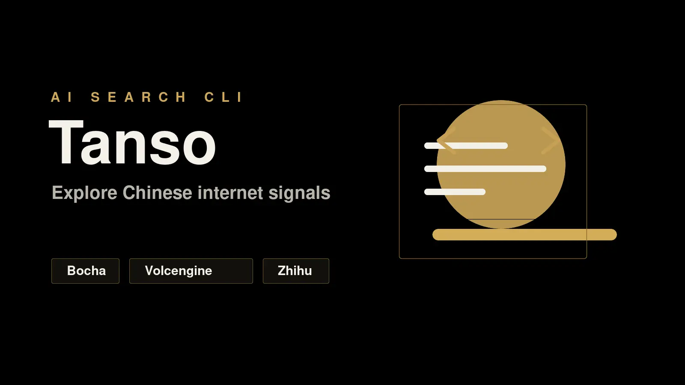

<div align="center">

# Findo

**Search Chinese web sources from one Go CLI.**



[](./LICENSE)
[](./go.mod)

</div>

Findo queries Bocha, Volcengine Ark, and Zhihu through provider APIs, then returns normalized terminal output or automation-safe JSON. It is built for developers, AI agents, and research workflows that need Chinese internet retrieval without scraping, browser sessions, or hidden side effects.

## Install

Recommended:

```bash
npm install -g @geekjourneyx/findo
findo version
```

The npm package installs the matching GitHub Release binary for your platform and verifies it against `SHA256SUMS`.

Alternative Go install:

```bash
go install github.com/geekjourneyx/findo/cmd/findo@v1.2.2
```

Prebuilt binaries and checksums are available on the [GitHub Releases](https://github.com/geekjourneyx/findo/releases) page.

From a local checkout:

```bash
make build
./findo version
```

## Configure

Initialize the default config file:

```bash
findo config init
findo config path
```

This creates a config file at the platform default path. On Linux this is typically:

```text
~/.config/findo/config.yaml
```

Run `findo config path` for the exact path on your machine.

Edit that file and set the credentials for the providers you want to use:

| Provider | Environment variables |
| --- | --- |
| Bocha | `BOCHA_API_KEY` |
| Volcengine Ark | `ARK_API_KEY` or `VOLCENGINE_API_KEY` |
| Zhihu | `ZHIHU_ACCESS_SECRET` or `ZHIHU_API_KEY` |

The config file uses the same provider fields:

```yaml
bocha:
  api_key: ""

volcengine:
  api_key: ""
  model: doubao-seed-2-0-lite-260215

zhihu:
  access_secret: ""
```

Configuration precedence is:

1. CLI flags
2. Environment variables
3. `--config` file or `~/.config/findo/config.yaml`
4. Built-in defaults

Inspect the merged config without leaking secrets:

```bash
findo config show --json
```

Before publishing a release, verify version alignment across `package.json`, `Makefile`, `CHANGELOG.md`, and the release tag:

```bash
make version-check
make release-check
```

## Quick Start

```bash
findo version
findo sources --json
findo skills list --json
findo skills read findo --json

BOCHA_API_KEY=... findo bocha "AI Agent 商业化" --json
ARK_API_KEY=... findo volc "瑞幸咖啡 2026 门店数是否可信" --json
ZHIHU_ACCESS_SECRET=... findo zhihu "AI 搜索" --json
ZHIHU_ACCESS_SECRET=... findo zhihu web "ChatGPT 桌面版" --json
ZHIHU_ACCESS_SECRET=... findo hot zhihu --json
```

Human output defaults to a table. Use `--json` for scripts, agents, CI, and downstream tools.

## Agent Skill

Findo embeds its Agent SOP in the release binary so agents can read instructions that match the executable on `PATH`:

```bash
findo skills list --json
findo skills read findo
findo skills read findo --json
```

`skills read` defaults to raw Markdown for direct agent context. With `--json`, the same content is returned in the `content` field with version metadata. Use this when an external skill install, README, or repository checkout may be older than the installed CLI.

## Output

Retrieval commands return a stable envelope. A successful JSON response looks like this:

```json
{
  "version": "1.2.2",
  "query": {
    "text": "AI Agent 商业化",
    "mode": "search",
    "sources": ["bocha_web"],
    "limit": 10
  },
  "status": "ok",
  "results": [
    {
      "source": "bocha_web",
      "title": "Example result title",
      "url": "https://example.com/article",
      "snippet": "A normalized summary from the provider response."
    }
  ],
  "source_status": [
    {
      "source": "bocha_web",
      "status": "ok",
      "results": 1,
      "effective_limit": 10,
      "duration_ms": 842,
      "error": null
    }
  ],
  "errors": []
}
```

Exit codes are part of the public contract:

| Code | Meaning |
| --- | --- |
| `0` | Success |
| `1` | Partial success |
| `2` | Invalid argument |
| `3` | Config error |
| `4` | Credential missing |
| `5` | Source error |
| `6` | Timeout |
| `7` | No results |
| `9` | Internal error |

## Sources

| Source ID | Command | Provider | Capability |
| --- | --- | --- | --- |
| `bocha_web` | `findo bocha` | Bocha | Web search |
| `volcengine_answer` | `findo volc` | Volcengine Ark | Web-grounded answer |
| `zhihu_search` | `findo zhihu` | Zhihu | In-site search |
| `zhihu_web` | `findo zhihu web` | Zhihu | Global web search |
| `zhihu_hot` | `findo hot zhihu` | Zhihu | Hotlist |

Zhihu global search supports provider-specific filters:

```bash
findo zhihu web "ChatGPT 桌面版" \
  --filter 'host=="example.com"' \
  --search-db realtime \
  --json
```

`--filter` and `--search-db` are only valid for `findo zhihu web`.

## Automation Contract

Findo keeps the automation contract narrow and predictable:

- stdout is reserved for results.
- stderr is reserved for diagnostics.
- JSON output keeps source IDs, source status, error codes, and exit codes stable.
- Provider behavior stays behind typed Go adapters.
- Built-in timeout defaults to `45s`; override it with `--timeout` when a workflow needs a different budget.

## Development

```bash
make build
make test
make lint
make release-check
```

The normal test suite does not require real provider credentials. Real API smoke checks are separate:

```bash
make smoke-bocha
make smoke-volcengine
make smoke-zhihu
```

## Non-Goals

Findo v1.0.0 intentionally does not implement browser scraping, cache, reranking, plugin runtime, MCP, stdin query input, Bocha image search, or Zhihu direct answer. Those boundaries keep the CLI small, testable, and stable.

## License

[MIT](./LICENSE)
